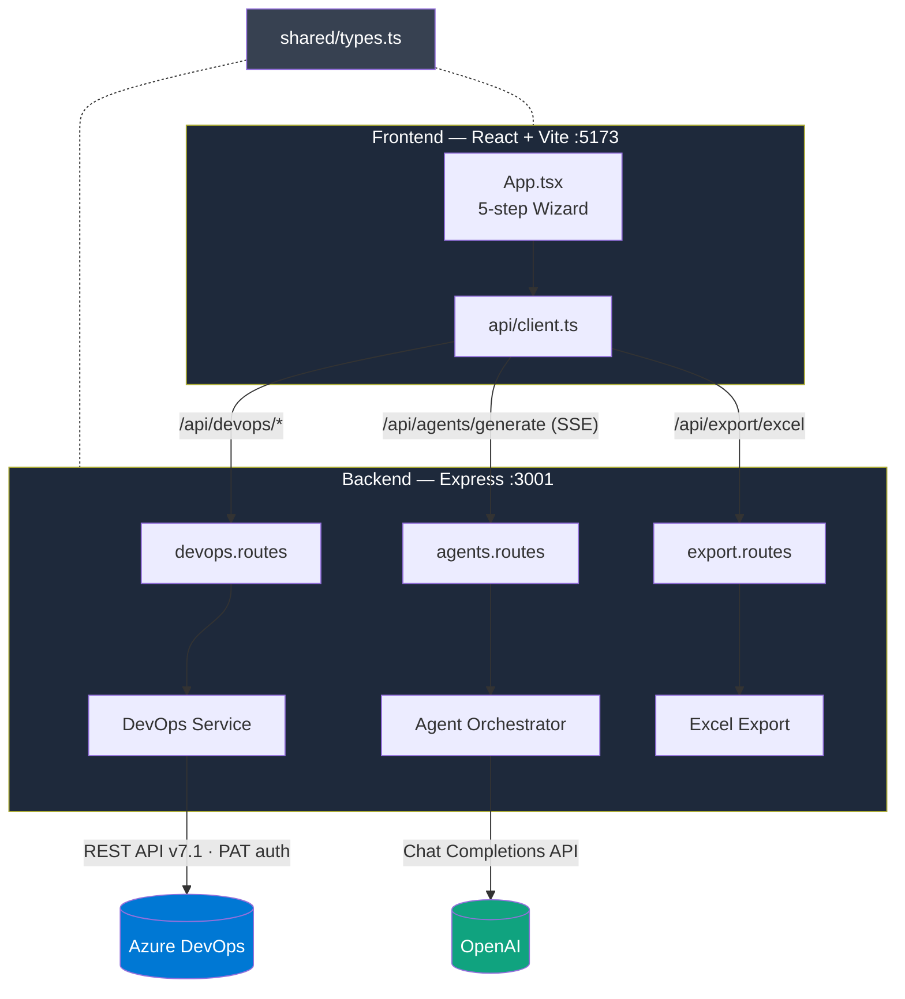
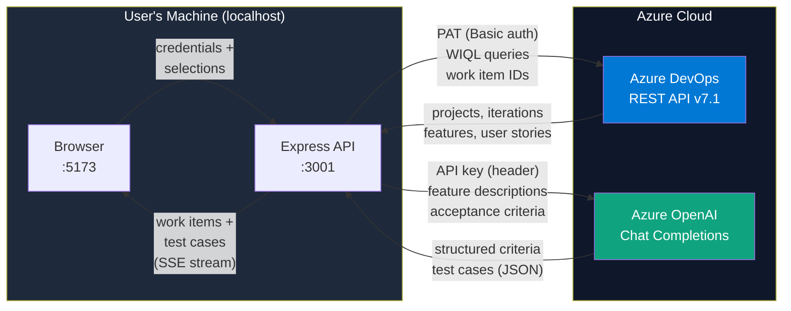
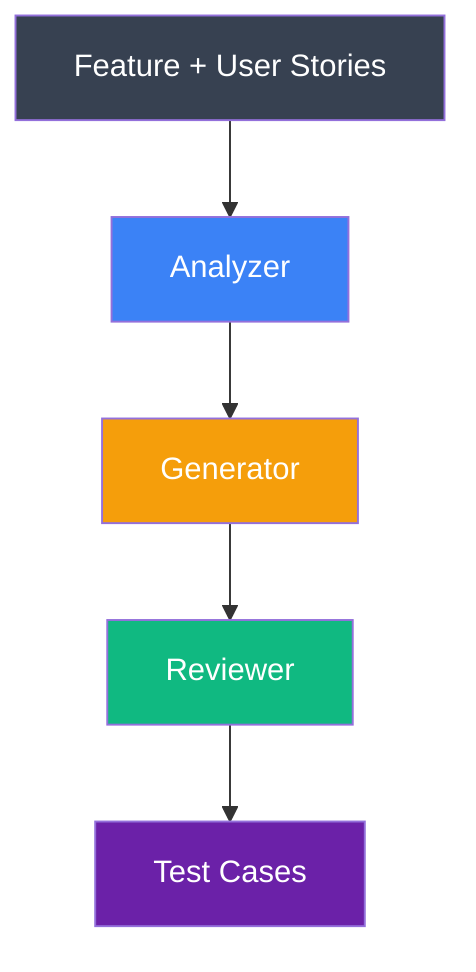
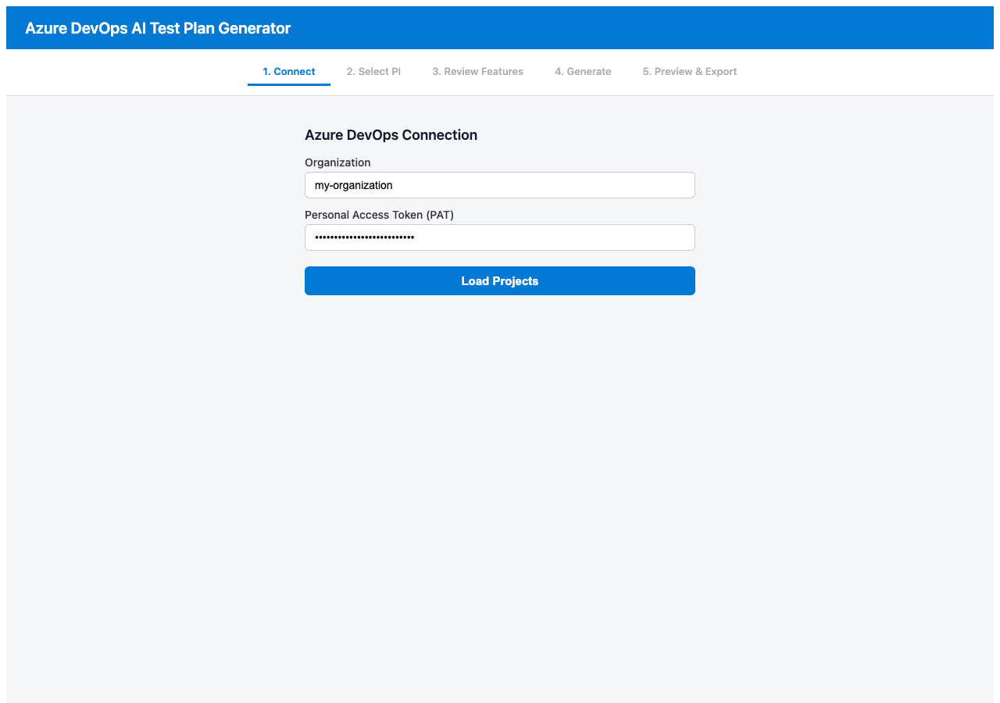
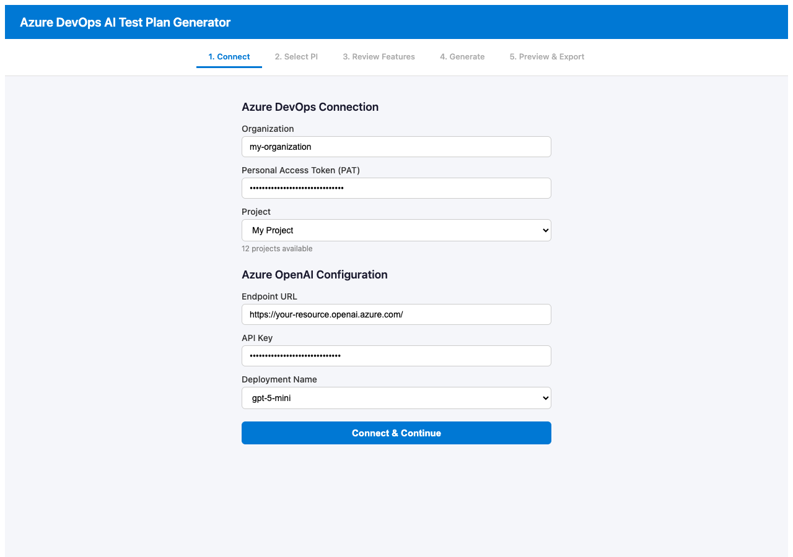
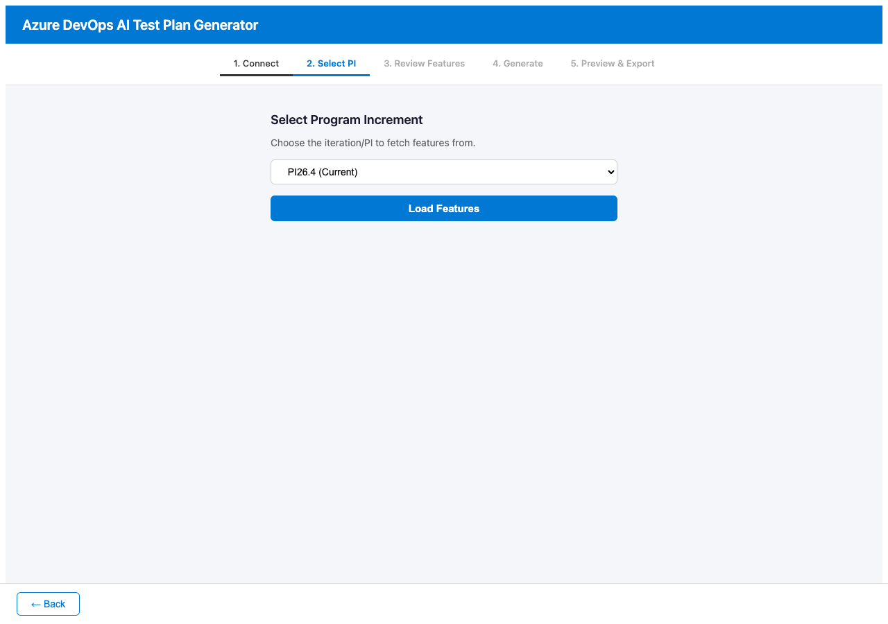
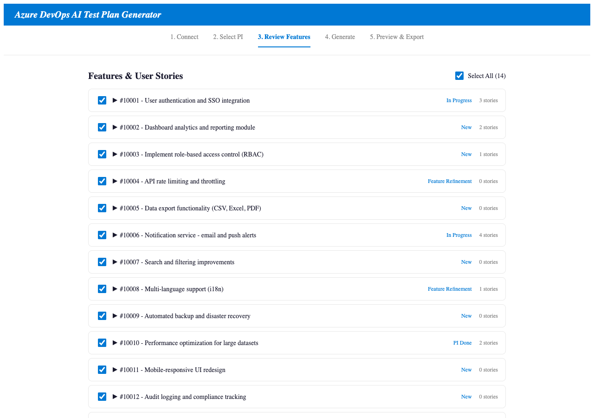
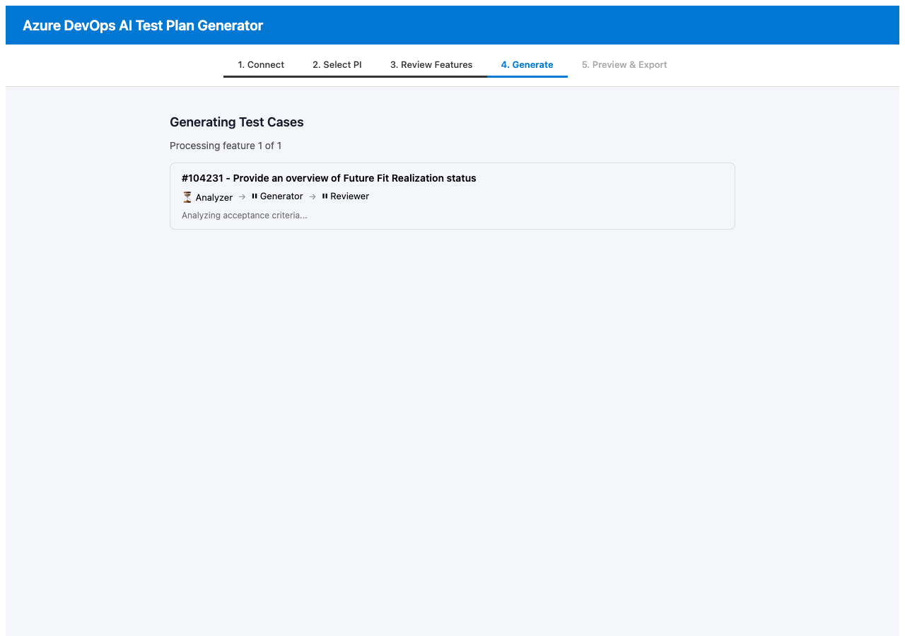
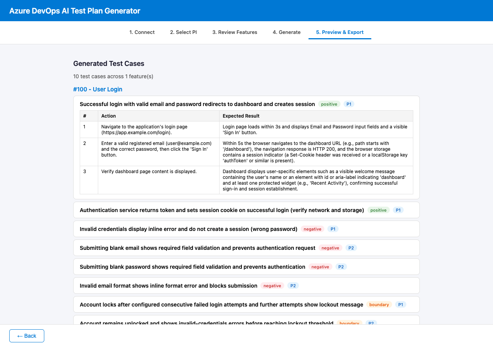

# ADO Test Generator

Local web application that connects to Azure DevOps, retrieves Features and linked User Stories for a selected PI (Program Increment), uses OpenAI to generate test cases from acceptance criteria, and exports them as Excel files importable into Azure Test Plans.

## Table of Contents

- [Prerequisites](#prerequisites)
- [Prerequisites Setup](#prerequisites-setup)
  - [Creating an Azure DevOps PAT](#creating-an-azure-devops-personal-access-token-pat)
  - [Creating an Azure OpenAI Instance](#creating-an-azure-openai-instance)
  - [Retrieving the Endpoint and API Key](#retrieving-the-azure-openai-endpoint-and-api-key)
- [Project Structure](#project-structure)
- [Setup](#setup)
- [Running](#running)
- [User Flow](#user-flow)
- [Architecture](#architecture)
- [Detailed Data Flow](#detailed-data-flow)
  - [Step 1 — Connect & Load Projects](#step-1--connect--load-projects)
  - [Step 2 — Load Iterations](#step-2--load-iterations)
  - [Step 3 — Load Features & User Stories](#step-3--load-features--user-stories)
  - [Step 4 — AI Test Case Generation](#step-4--ai-test-case-generation)
  - [Step 5 — Excel Export](#step-5--excel-export)
  - [Data Flow Diagram](#data-flow-diagram)
- [Security Controls](#security-controls)
  - [Authentication & Credentials](#authentication--credentials)
  - [Network & Processing Boundaries](#network--processing-boundaries)
  - [What Stays Local](#what-stays-local)
  - [Recommendations for Production Use](#recommendations-for-production-use)
- [AI Pipeline](#ai-pipeline)
  - [Agent Prompts](#agent-prompts)
    - [Analyzer Agent](#analyzer-agent)
    - [Generator Agent](#generator-agent)
    - [Reviewer Agent](#reviewer-agent)
- [Step-by-Step Guide](#step-by-step-guide)
- [Tech Stack](#tech-stack)

## Prerequisites

- **Node.js** v18+
- **Azure DevOps** Personal Access Token (PAT) with read access to work items
- **Azure OpenAI** instance deployed with at least one model deployment (endpoint URL and API key)
- **Well-documented work items** — Features and User Stories must have clearly and completely documented descriptions and acceptance criteria, as these are the primary input for test case generation

## Prerequisites Setup

### Creating an Azure DevOps Personal Access Token (PAT)

1. Sign in to your Azure DevOps organization (`https://dev.azure.com/{your-org}`)
2. Click on the **User settings** icon (person with gear) in the top-right corner
3. Select **Personal access tokens**
4. Click **+ New Token**
5. Configure the token:
   - **Name**: Give it a descriptive name (e.g., `ado-test-generator`)
   - **Organization**: Select the target organization
   - **Expiration**: Choose an appropriate expiry date
   - **Scopes**: Select **Custom defined**, then grant:
     - **Work Items** → **Read**
     - **Project and Team** → **Read**
6. Click **Create** and **copy the token immediately** — it won't be shown again

### Creating an Azure OpenAI Instance

1. Sign in to the [Azure Portal](https://portal.azure.com)
2. Click **+ Create a resource** and search for **Azure OpenAI**
3. Click **Create** and fill in the details:
   - **Subscription**: Select your Azure subscription
   - **Resource group**: Create new or select existing
   - **Region**: Choose a region where Azure OpenAI is available (e.g., Sweden Central, East US)
   - **Name**: Enter a unique resource name (e.g., `my-openai-instance`)
   - **Pricing tier**: Select **Standard S0**
4. Click **Review + create**, then **Create**
5. Once deployed, go to the resource and open **Azure AI Foundry** (link in the overview page)
6. Navigate to **Deployments** → **+ Deploy model** → **Deploy base model**
7. Select a model (e.g., `gpt-4o` or `gpt-4o-mini`) and click **Confirm**
8. Set a **deployment name** (this is what you enter in the app's "Deployment Name" field) and click **Deploy**

### Retrieving the Azure OpenAI Endpoint and API Key

1. In the Azure Portal, navigate to your **Azure OpenAI** resource
2. In the left menu, click **Keys and Endpoint** (under Resource Management)
3. Copy the following values:
   - **Endpoint**: The URL shown (e.g., `https://my-openai-instance.openai.azure.com/`)
   - **Key**: Click **Show** next to KEY 1 or KEY 2 and copy the value
4. Enter both values in the app's connection form along with the deployment name from the previous step

## Project Structure

```
ado-test-generator/
├── backend/          # Express + TypeScript API server (port 3001)
│   └── src/
│       ├── routes/           # API endpoints
│       │   ├── devops.routes.ts    # Azure DevOps proxy endpoints
│       │   ├── agents.routes.ts    # AI generation endpoints (SSE)
│       │   └── export.routes.ts    # Excel export endpoint
│       └── services/
│           ├── devops.service.ts         # Azure DevOps REST API client
│           ├── excel-export.service.ts   # Excel file generation
│           ├── agent-orchestrator.ts     # AI pipeline orchestration
│           └── agents/                   # AI agent implementations
├── frontend/         # React + Vite UI (port 5173)
│   └── src/
├── shared/           # Shared TypeScript types
│   └── types.ts
├── package.json      # Workspace root
└── tsconfig.base.json
```

## Setup

```bash
# Install all dependencies (root, backend, frontend, shared)
npm install
```

## Running

```bash
# Start both backend and frontend in dev mode
npm run dev
```

- **Frontend**: http://localhost:5173
- **Backend**: http://localhost:3001

## User Flow

The app follows a 5-step wizard flow:


| Step | Description |
|------|-------------|
| **1. Connect** | Enter Azure DevOps organization, PAT, select project, and provide OpenAI API key |
| **2. Select PI** | Choose a Program Increment (iteration path) to scope work items |
| **3. Review Features** | Browse and select Features with their linked User Stories |
| **4. Generate** | 3-agent AI pipeline with real-time SSE progress streaming |
| **5. Preview & Export** | Review generated test cases and download as `.xlsx` |

## Architecture



## Detailed Data Flow

The following describes exactly what data is sent, where it is processed, and what is returned at each stage. All processing runs locally on the user's machine (frontend + backend). The only external calls are to Azure DevOps and Azure OpenAI.

### Step 1 — Connect & Load Projects

| Direction | Endpoint | Data sent | Data received |
|-----------|----------|-----------|---------------|
| Frontend → Backend | `POST /api/devops/projects` | Organization name, PAT | List of project names |
| Backend → Azure DevOps | `GET https://dev.azure.com/{org}/_apis/projects` | PAT (Basic auth header) | Project metadata |

### Step 2 — Load Iterations

| Direction | Endpoint | Data sent | Data received |
|-----------|----------|-----------|---------------|
| Frontend → Backend | `POST /api/devops/iterations` | Organization, PAT, project name | Iteration tree (PI hierarchy) |
| Backend → Azure DevOps | `GET .../_apis/wit/classificationnodes/Iterations` | PAT (Basic auth header) | Iteration paths and dates |

### Step 3 — Load Features & User Stories

| Direction | Endpoint | Data sent | Data received |
|-----------|----------|-----------|---------------|
| Frontend → Backend | `POST /api/devops/features` | Organization, PAT, project, iteration path | Features with nested User Stories |
| Backend → Azure DevOps | `POST .../_apis/wit/wiql` | WIQL query filtering by iteration path | Work item IDs |
| Backend → Azure DevOps | `GET .../_apis/wit/workitems` (batches of 200) | Work item IDs | Titles, descriptions, acceptance criteria, relations |

**Data extracted from work items:** ID, title, description (HTML → plain text), acceptance criteria (HTML → plain text), state, work item type, and parent/child relations.

### Step 4 — AI Test Case Generation

| Direction | Endpoint | Data sent | Data received |
|-----------|----------|-----------|---------------|
| Frontend → Backend | `POST /api/agents/generate` (SSE) | OpenAI config (endpoint, key, deployment) + selected features with user stories | SSE event stream with progress + generated test cases |
| Backend → Azure OpenAI | `POST .../openai/deployments/{model}/chat/completions` | System prompt + feature/story descriptions and acceptance criteria (plain text) | Structured JSON: criteria, test cases, review notes |

**What is sent to Azure OpenAI:** For each selected feature, the AI agents receive:
- Feature title and description (plain text)
- Linked user story titles, descriptions, and acceptance criteria (plain text)
- Agent-specific system prompts defining the task (analyze, generate, or review)

**What is NOT sent to Azure OpenAI:** Organization name, PAT, project metadata, iteration paths, work item IDs, or any authentication credentials.

The 3-agent pipeline processes each feature sequentially:

1. **Analyzer** — receives feature + stories → returns structured criteria (categorized as functional, edgeCase, validation, integration, or uiUx)
2. **Generator** — receives structured criteria → returns draft test cases with steps, actions, and expected results
3. **Reviewer** — receives draft test cases + original criteria → returns refined test cases with coverage gaps filled

Each agent call uses the Azure OpenAI Chat Completions API with JSON response format. Retry logic: 3 attempts with exponential backoff (1s, 2s, 4s). Max completion tokens: 16,384.

### Step 5 — Excel Export

| Direction | Endpoint | Data sent | Data received |
|-----------|----------|-----------|---------------|
| Frontend → Backend | `POST /api/export/excel` | Generated test cases + feature metadata + project name | `.xlsx` file (binary download) |

**No external calls.** The Excel file is generated locally by the backend using ExcelJS. The file contains two sheets:
- **Test Cases** — formatted for Azure Test Plans import (ID, title, steps, priority, area path, iteration path)
- **Summary** — feature-level statistics (criteria count, test case count, type distribution)

### Data Flow Diagram



## Security Controls

### Authentication & Credentials

| Credential | Scope | How it's used | Storage |
|------------|-------|---------------|---------|
| **Azure DevOps PAT** | Work Items (Read), Project and Team (Read) | Base64-encoded in `Authorization: Basic` header for every DevOps API call | In-memory only (React state). Not persisted to disk, localStorage, or cookies. |
| **Azure OpenAI API Key** | Full access to the OpenAI resource | Passed to the Azure OpenAI SDK, sent as `api-key` header | In-memory only (React state). Not persisted. |
| **Azure OpenAI Endpoint** | Identifies the OpenAI resource | Used as the base URL for API calls | In-memory only (React state). Not persisted. |

### Network & Processing Boundaries

- **All processing runs locally.** The frontend (port 5173) and backend (port 3001) both run on the user's machine. No intermediate cloud services are involved.
- **Two external API calls** are made, both over HTTPS:
  1. **Azure DevOps REST API** (`dev.azure.com`) — to read projects, iterations, and work items
  2. **Azure OpenAI API** (`*.openai.azure.com`) — to generate test cases from acceptance criteria
- **Data sent to Azure OpenAI** is limited to feature/story text content (titles, descriptions, acceptance criteria). No credentials, IDs, or organizational metadata are sent.
- **CORS** is enabled on the backend. In the current development configuration, all origins are allowed.
- **JSON payload size** is limited to 10MB on the backend.

### What Stays Local

- User credentials (PAT, API key) — held in browser memory only, never written to disk
- Work item metadata (IDs, iteration paths, area paths)
- Generated test cases and Excel exports
- All HTML-to-text conversion and data transformation

### Recommendations for Production Use

- Use environment variables or a secrets manager instead of entering credentials in the UI
- Restrict CORS to the frontend origin only
- Add authentication to the backend API endpoints (currently unauthenticated)
- Deploy behind a reverse proxy with TLS termination
- Consider Azure Managed Identity instead of API keys for Azure OpenAI access

## AI Pipeline

Each feature's test cases are generated through three sequential AI agents:



Progress is streamed to the frontend in real-time via Server-Sent Events (SSE).

Currently deployed with GPT-5-mini on Azure OpenAI. The deployment name is configurable in the UI.

### Agent Prompts

Below are the exact system prompts used by each agent. The user message for each call contains the structured input described in the data flow section above.

#### Analyzer Agent

> **Source:** `backend/src/services/agents/analyzer.agent.ts`

```
You are a QA analyst specializing in extracting and structuring acceptance criteria from software requirements.

Given a Feature and its linked User Stories from Azure DevOps, you must:
1. Extract all explicit acceptance criteria from the feature and each user story
2. Infer additional criteria from descriptions when acceptance criteria are missing or incomplete
3. Categorize each criterion into one of: functional, edgeCase, validation, integration, uiUx
4. Mark each as "explicit" (directly stated) or "inferred" (derived from context)

Respond with JSON in this exact format:
{
  "featureId": <number>,
  "featureTitle": "<string>",
  "categories": {
    "functional": [{ "id": "F-AC-1", "description": "<criterion>", "source": "explicit"|"inferred", "sourceStoryId": <number|null> }],
    "edgeCase": [...],
    "validation": [...],
    "integration": [...],
    "uiUx": [...]
  }
}

Rules:
- Each criterion ID should be unique and follow pattern: F-AC-<number> for feature-level, S<storyId>-AC-<number> for story-level
- Be thorough but avoid duplicates across categories
- If a user story has no acceptance criteria and no meaningful description, note it but still try to infer at least one criterion
- Keep descriptions concise and testable
```

**User message format:** A markdown document containing the feature ID, title, state, description, acceptance criteria, and all linked user stories with their own descriptions and acceptance criteria.

#### Generator Agent

> **Source:** `backend/src/services/agents/generator.agent.ts`

```
You are a QA test case engineer. Given structured acceptance criteria, generate comprehensive test cases.

For each criterion, create one or more test cases with detailed steps. Each test case must include:
- A clear, descriptive title (max 128 characters)
- A test type: "positive" (happy path), "negative" (error/failure), or "boundary" (edge values)
- A priority: 1 (Critical), 2 (High), 3 (Medium), 4 (Low)
- Numbered steps with specific actions and expected results
- Links to the criteria IDs being tested

Respond with JSON in this exact format:
{
  "testCases": [
    {
      "title": "<max 128 chars>",
      "featureId": <number>,
      "featureTitle": "<string>",
      "userStoryId": <number|null>,
      "priority": 1|2|3|4,
      "testType": "positive"|"negative"|"boundary",
      "steps": [
        { "stepNumber": 1, "action": "<what the tester does>", "expectedResult": "<what should happen>" }
      ],
      "linkedCriteriaIds": ["F-AC-1", "S123-AC-2"]
    }
  ]
}

Rules:
- Create at least one positive test for each functional criterion
- Create negative tests for validation criteria
- Create boundary tests for edge case criteria
- Each test must have at least 2 steps
- Actions should be specific and actionable (e.g., "Click the Submit button" not "Submit the form")
- Expected results must be observable and verifiable
- Title must not exceed 128 characters
- Aim for 2-5 test cases per criterion category, depending on complexity
```

**User message format:** The JSON output from the Analyzer agent (structured criteria with categories and criterion IDs).

#### Reviewer Agent

> **Source:** `backend/src/services/agents/reviewer.agent.ts`

```
You are a senior QA reviewer. Review test cases for quality, coverage, and completeness.

Given the original acceptance criteria and generated test cases, you must:
1. Verify every acceptance criterion has at least one test case covering it
2. Improve vague expected results to be specific and measurable
3. Remove redundant test cases (keep the more comprehensive one)
4. Add missing edge case or boundary tests if obvious gaps exist
5. Ensure test steps are in logical order and each step has both action and expected result
6. Verify all titles are under 128 characters

Respond with JSON in this exact format:
{
  "testCases": [
    {
      "title": "<max 128 chars>",
      "featureId": <number>,
      "featureTitle": "<string>",
      "userStoryId": <number|null>,
      "priority": 1|2|3|4,
      "testType": "positive"|"negative"|"boundary",
      "steps": [
        { "stepNumber": 1, "action": "<specific action>", "expectedResult": "<specific expected result>" }
      ],
      "linkedCriteriaIds": ["F-AC-1"],
      "areaPath": "<string>"
    }
  ],
  "reviewNotes": {
    "added": <number>,
    "removed": <number>,
    "modified": <number>,
    "coverageGaps": ["<description of any remaining gaps>"]
  }
}

Rules:
- Return the complete final set of test cases (not just changes)
- Maintain all existing fields (featureId, areaPath, etc.)
- Only add test cases if there are clear coverage gaps
- Prefer improving existing tests over adding new ones
- Expected results must be observable: "Error message 'Invalid email' is displayed" not "Error is shown"
```

**User message format:** A JSON object containing both the original `criteria` (from the Analyzer) and the `testCases` (from the Generator).

## Step-by-Step Guide

### Step 1: Connect to Azure DevOps & Azure OpenAI

Open `http://localhost:5173`. Enter your Azure DevOps **organization** name and **Personal Access Token**, then click **Load Projects**.



Once projects load, select a **project** from the dropdown. Then configure the **Azure OpenAI** endpoint URL, API key, and deployment name. Click **Connect & Continue**.



### Step 2: Select Program Increment

Choose the **iteration/PI** you want to generate test cases for. The current PI is auto-selected. Click **Load Features** to proceed.



### Step 3: Review and Select Features

All Features for the selected PI are loaded with their linked User Stories. Review the list, expand features to inspect descriptions and acceptance criteria, and use the checkboxes to select which features to include. Click **Generate Test Cases** when ready.



### Step 4: Generate Test Cases

The 3-agent AI pipeline processes each selected feature sequentially. Real-time progress is streamed via SSE — you can see each agent's status (Analyzer, Generator, Reviewer) per feature.



### Step 5: Preview & Export

Once generation completes, the app transitions to the preview screen. Test cases are grouped by feature and can be expanded to show individual steps (action + expected result), priority, and test type badges. Use the **Export** button to download a `.xlsx` file formatted for Azure Test Plans import.



## Tech Stack

- **Frontend**: React 18, Vite 5, TypeScript
- **Backend**: Express 4, TypeScript, tsx (dev runner)
- **AI**: Azure OpenAI API (`openai` npm package), GPT-5-mini
- **Export**: ExcelJS
- **Azure DevOps**: REST API v7.1 with PAT authentication
- **Monorepo**: npm workspaces


## TODO
- Docker version
- 1 time credential configurations
